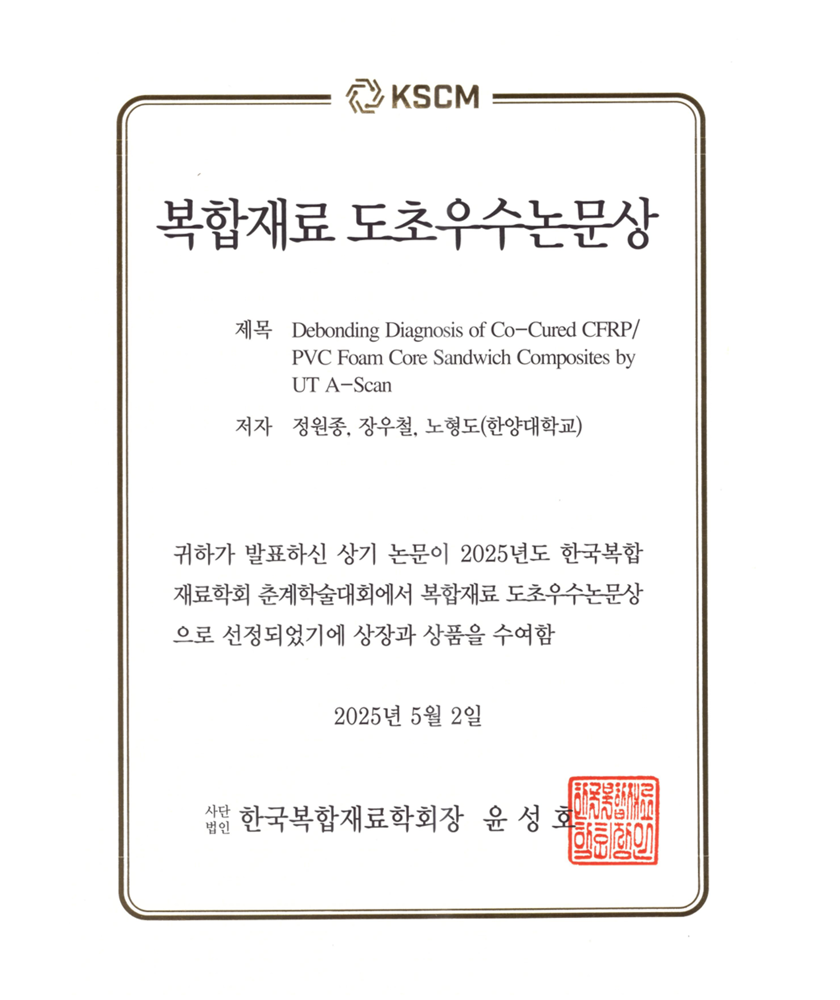
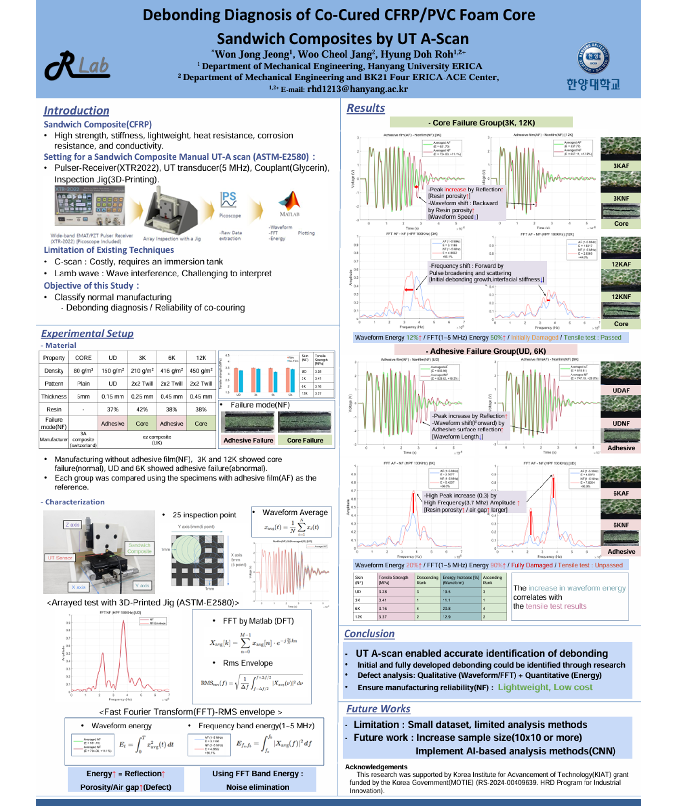
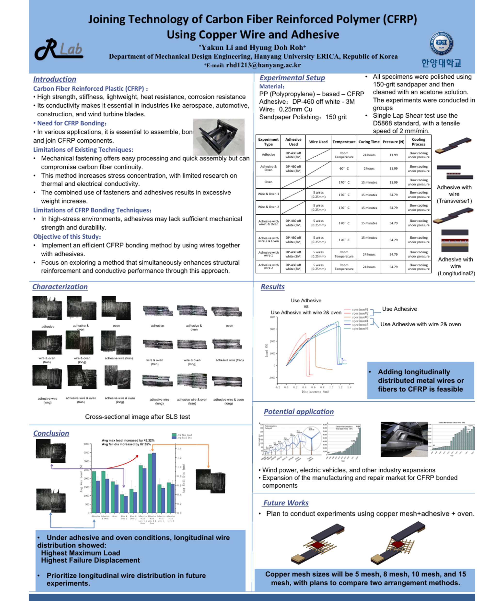
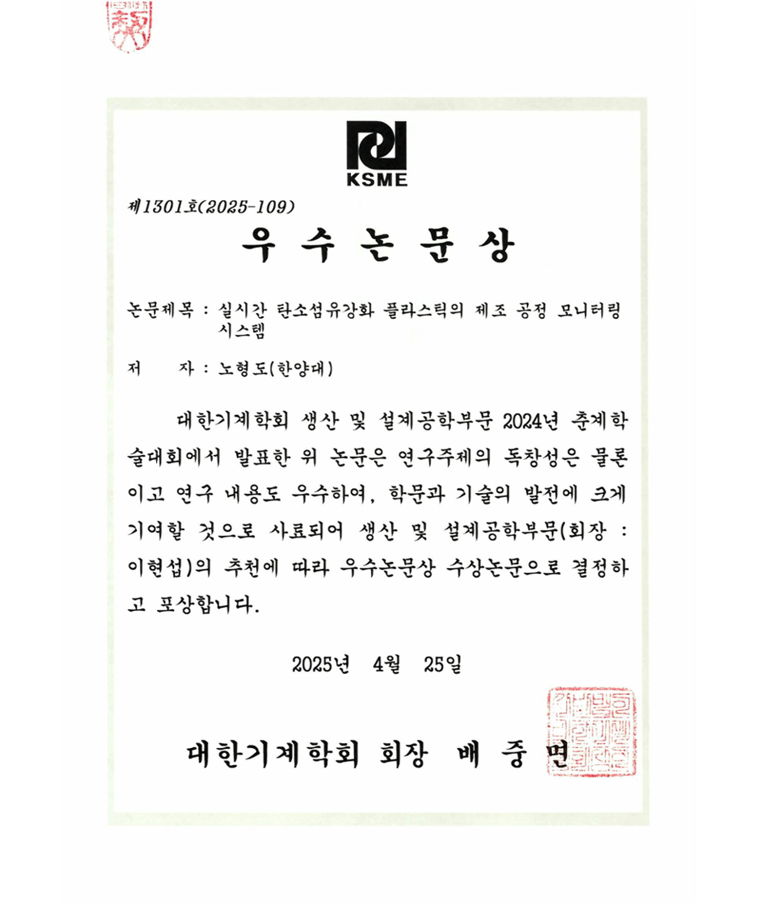
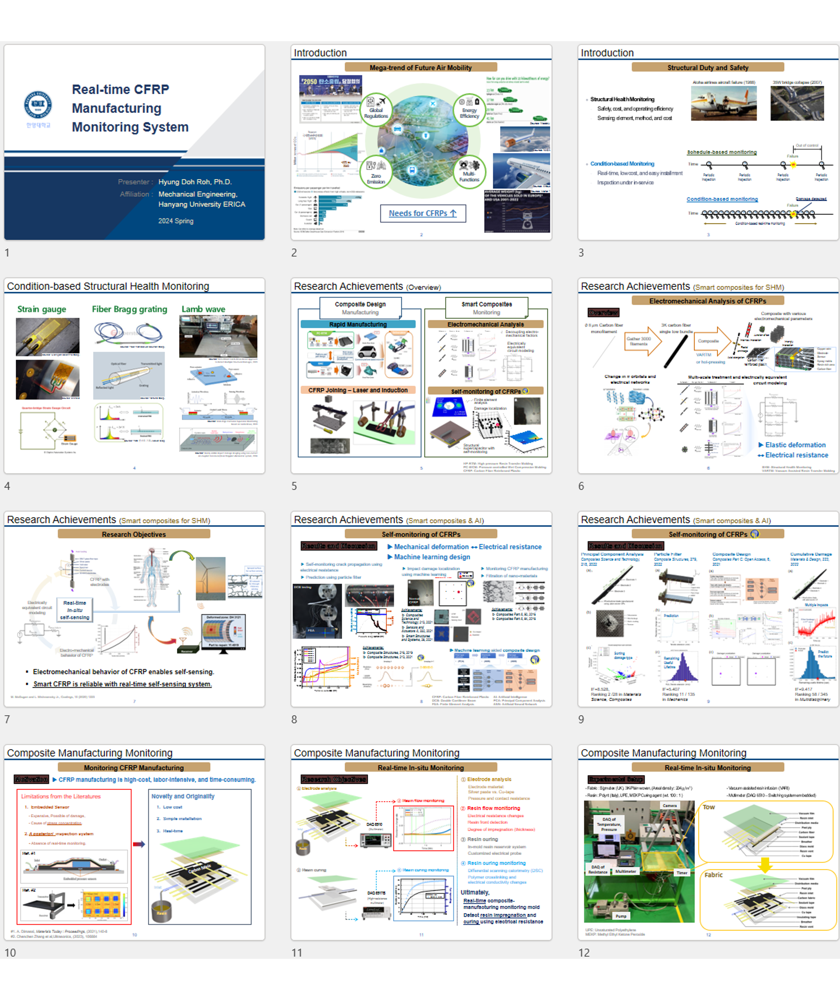

# Congratulations!

### **KSCM 2025**
    
* Title (Eng): Debonding Diagnosis of Co-cured CFRP/PVC Foam Core Sandwich Composites by UT A-scan  
* Title (Kor): 초음파 A-scan을 이용한 공동경화된 CFRP/PVC 폼코어 샌드위치 복합재의 접합 성능 평가  
* Researcher: Won Jong Jeong, Woo Cheol Jang and Hyung Doh Roh  
* Topic: Non-destructive Evaluation of CFRP/PVC Foam Core Sandwich Composite using Acousto-ultrasonic Testing
* Conference: 2025년도 한국복합재료학회 춘계학술대회  
* Location: Shinhwa World, Jeju, Republic of Korea  
 

### **KSCM 2024**
    
* Title (Eng): Joining Technology of Carbon Fiber Reinforced Polymer (CFRP) using Copper Wire and Adhesive  
* Title (Kor): 구리선과 접착제를 이용한 탄소섬유강화 플라스틱의 접합 기술  
* Researcher: Yakun Li and Hyung Doh Roh  
* Topic: Enhancing Fastener-free Joining Performance of CFRPs using copper wire and adhesive
* Conference: 2024년도 한국복합재료학회 추계학술대회  
* Location: BPEX, Busan, Republic of Korea  
 

### **KSME 2024**
   
* Title (Eng): Real-time CFRP Manufacturing Monitoring System  
* Title (Kor): 실시간 탄소섬유강화 플라스틱의 제조 공정 모니터링 시스템  
* Researcher: Hyung Doh Roh  
* Topic: In-situ Real-time CFRP Manufacturing Monitoring System using Electrical Resistance
* Conference: 대한기계학회 생산 및 설계공학부문 2024년 춘계학술대회  
* Location: Aqua Palace Hotel, Busan, Republic of Korea  
 

 
# To be continued soon 

 

[Back](./)
 
 
