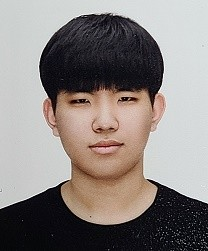
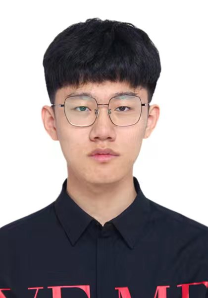
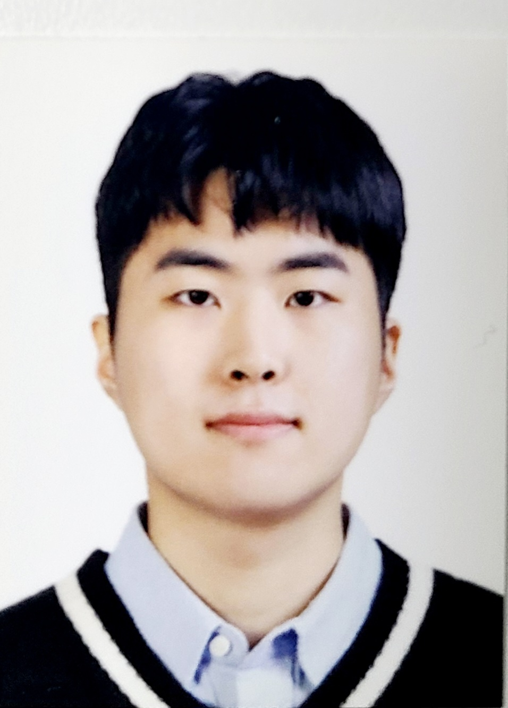

#### **We are recruiting our lab members!**
#### **Any majors are Welcome!**
#### **All you need is enthusiasm!**
 
 

# Graduate

### **Li, Yakun**
  
Education | B.S. in Mechanical Engineering, Hanyang University ERICA, 2024  
Research Area | Smart composites  
Technical Skills | CATIA, ANSYS, MS Office, and MATLAB  
Personal Interests | Motor vehicles  
Contact via <a href="mailto:liyakun1115@hanyang.ac.kr"> E-mail</a>  
 

### **Xin, YaoZhong**
  
Education | B.S. in Mechanical Engineering, Hanyang University ERICA, 2024  
Research Area | Smart composites  
Technical Skills | Design and Simulation: SolidWorks, AutoCad, and ANSYS; Data analysis: Python and MS Office;  
Personal Interests | Badminton and Lego  
Contact via <a href="mailto:styxhin@hanyang.ac.kr"> E-mail</a>  
 

### **Jang, Woo Cheol**
  
Education | B.S. in Aviation Maintenance Engineering, Korea Polytechnics, 2021   
Research Area | Thermoforming of sandwich composites    
Technical Skills | CATIA, AutoCAD and Manufacturing (Hand layup, Infusion, Prepreg)   
Personal Interests | SCUBA and snowboard   
Contact via <a href="mailto:hioucher@hanyang.ac.kr"> E-mail</a>  
 

 

# Undergraduate

### **Jeong, WonJong**
  
Education | Undergraduate in Mechanical Engineering, Hanyang University ERICA since 2022  
Research Area | Ultrasonic testing   
Technical Skills | AutoCad, Inventor, Solidworks  
Personal Interests | Automobile  
Contact via <a href="mailto:doldol0202@gmail.com"> E-mail</a>  
 

### **Lee, Gyu Hwa**
  
Education | Undergraduate in Mechanical Engineering, Hanyang University ERICA since 2020  
Research Area | Smart composites  
Technical Skills | CATIA, MATLAB and MS Office  
Personal Interests | Aerospace  
Contact via <a href="mailto:mszzangso@hanyang.ac.kr"> E-mail</a>  
 

### **Gao, HaoChen**
  
Education | Undergraduate in Mechanical Engineering, Hanyang University ERICA since 2022  
Research Area | Classic laminate plate theory  
Technical Skills | AutoCAD, MATLAB and MS Office  
Personal Interests | Bike riding and badminton  
Contact via <a href="mailto:G1215981061@outlook.com"> E-mail</a>  
 

### **Kim, HyeonIl**
  
Education | Undergraduate in Mechanical Engineering, Hanyang University ERICA since 2022  
Research Area | Smart composites  
Technical Skills | CATIA, Python and C  
Personal Interests | Defense industry  
Contact via <a href="mailto:henrykim025@hanyang.ac.kr"> E-mail</a>  
 

 

[Back](./)
 
 
