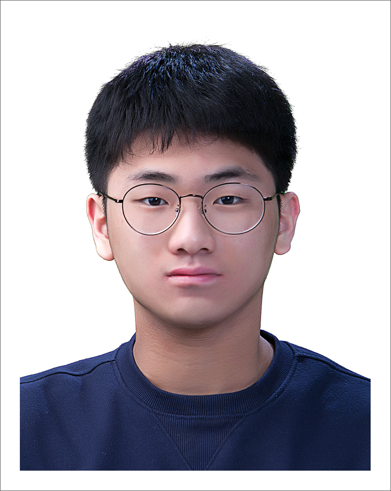

# Graduate

##### **We are recruiting our lab members!**
##### **Any majors are Welcome!**
##### **All you need is enthusiasm!**

 

 

# Undergraduate

### **Kim, DongHun**
  
Education | Undergraduate in Mechanical Engineering, Hanyang University ERICA since 2023  
Research Area | Data Science of CFRP Using Machine Learning  
Technical Skills | Design and Simulation: CATIA, AutoCad, and ANSYS / Data analysis: Python, MATLAB, and MS Office  
Personal Interests | Tennis, YouTube  
Contact via <a href="mailto:gazicola@hanyang.ac.kr"> E-mail</a>  
 
### **Park, Sejun**
  
Education | Undergraduate in Mechanical Engineering, Hanyang University ERICA since 2023  
Research Area | Manufacturing process of CFRP and High-pressure molding of CFRP  
Technical Skills | Design and simulation: CAD and CATIA / Data analysis: R programming, MATLAB, and Excel  
Personal Interests | Tennis, YouTube  
Contact via <a href="mailto:ddl07113@hanyang.ac.kr"> E-mail</a>  
 
### **Li, Yakun**
  
Education | Undergraduate in Mechanical Engineering, Hanyang University ERICA since 2023  
Research Area | Smart composites  
Technical Skills | CATIA, ANSYS, MS Office, and MATLAB  
Personal Interests | Motor vehicles  
Contact via <a href="mailto:liyakun15@hanyang.ac.kr"> E-mail</a>  
 

 

[Back](./)
 
 
