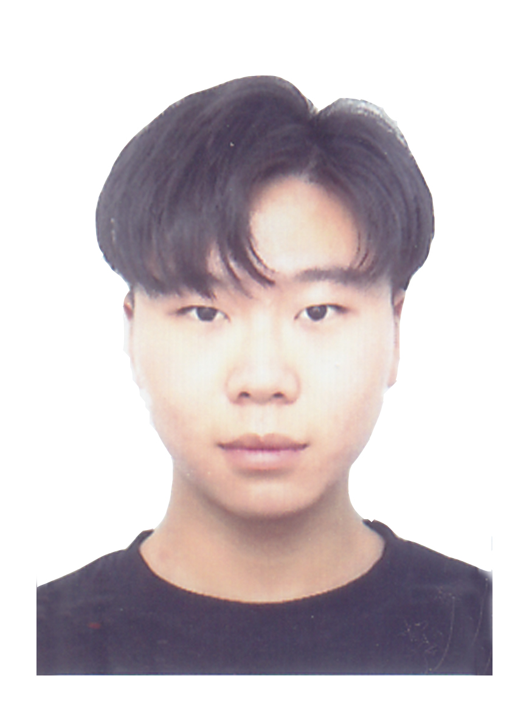

# Graduate

##### **We are recruiting our lab members!**
##### **Any majors are Welcome!**
##### **All you need is enthusiasm!**

 

 

# Undergraduate

### **Li, Yakun**
  
Education | Undergraduate in Mechanical Engineering, Hanyang University ERICA since 2023  
Research Area | Smart composites  
Technical Skills | CATIA, ANSYS, MS Office, and MATLAB  
Personal Interests | Motor vehicles  
Contact via <a href="mailto:liyakun1115@hanyang.ac.kr"> E-mail</a>  
 

### **Xin, YaoZhong**
  
Education | Undergraduate in Mechanical Engineering, Hanyang University ERICA since 2021  
Research Area | Smart composites  
Technical Skills | Design and Simulation: SolidWorks, AutoCad, and ANSYS; Data analysis: Python and MS Office;  
Personal Interests | Badminton and Lego  
Contact via <a href="mailto:styxhin@hanyang.ac.kr"> E-mail</a>  
 

### **Jang, Woo Cheol**
 
Education : Undergraduate in Aviation Maintenance Engineering , Korea Polytechnics since 2017
Research Area : Thermoforming of sandwich composites ,
Technical Skills : CATIA, AutoCAD Manufacturing (Hand layup, Infusion, Prepreg)
Personal Interests : SCUBA , Snowboard
Contact via <a href="mailto:hioucher@hanyang.ac.kr"> E-mail</a>  
 

 

[Back](./)
 
 
