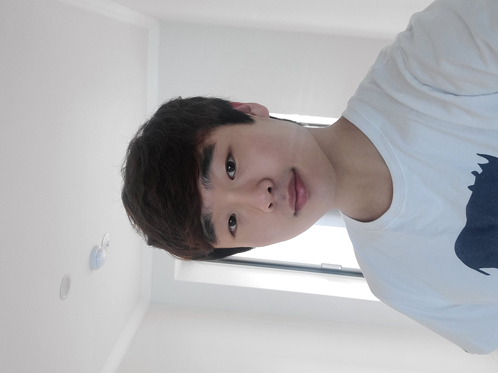

#### **We are recruiting our lab members!**
#### **Any majors are Welcome!**
#### **All you need is enthusiasm!**
 
 

# Graduate

 

### **Li, Yakun**
  
Education | Undergraduate in Mechanical Engineering, Hanyang University ERICA since 2023  
Research Area | Smart composites  
Technical Skills | CATIA, ANSYS, MS Office, and MATLAB  
Personal Interests | Motor vehicles  
Contact via <a href="mailto:liyakun1115@hanyang.ac.kr"> E-mail</a>  
 

### **Xin, YaoZhong**
  
Education | Undergraduate in Mechanical Engineering, Hanyang University ERICA since 2021  
Research Area | Smart composites  
Technical Skills | Design and Simulation: SolidWorks, AutoCad, and ANSYS; Data analysis: Python and MS Office;  
Personal Interests | Badminton and Lego  
Contact via <a href="mailto:styxhin@hanyang.ac.kr"> E-mail</a>  
 

### **Jang, Woo Cheol**
  
Education | Undergraduate in Aviation Maintenance Engineering , Korea Polytechnics since 2017   
Research Area | Thermoforming of sandwich composites    
Technical Skills | CATIA, AutoCAD and Manufacturing (Hand layup, Infusion, Prepreg)   
Personal Interests | SCUBA and Snowboard   
Contact via <a href="mailto:hioucher@hanyang.ac.kr"> E-mail</a>  
 

 

# Undergraduate

 

### **Jeong, WonJong**
  
Education | Undergraduate in Mechanical Engineering, Hanyang University ERICA since 2022  
Research Area | Ultrasonic Testing   
Technical Skills | AutoCad, Inventor, Solidworks  
Personal Interests | Automobile  
Contact via <a href="mailto:doldol0202@gmail.com"> E-mail</a>  
 

### **Lee, Gyu Hwa**
  
Education | Undergraduate in Mechanical Engineering, Hanyang University ERICA since 2020  
Research Area | Smart composites  
Technical Skills | CATIA, MATLAB and MS Office  
Personal Interests | Aerospace  
Contact via <a href="mailto:mszzangso@hanyang.ac.kr"> E-mail</a>  
 

 

[Back](./)
 
 
